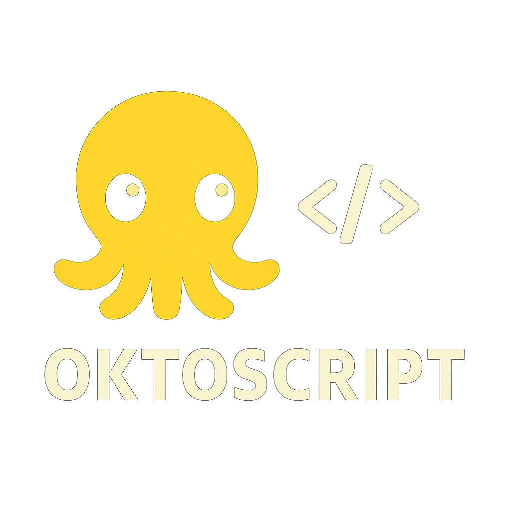

<p align="center">
  
</p>

<p align="center">
  
</p>

<h1 align="center">🐙 OktoScript</h1>

<p align="center">
  <strong>Domain-specific language for AI training, evaluation and deployment</strong>
</p>

<p align="center">
  Built by <strong>OktoSeek AI</strong> for the <strong>OktoSeek ecosystem</strong>
</p>

<p align="center">
  <a href="https://www.oktoseek.com/">OktoSeek Homepage</a> •
  <a href="https://huggingface.co/OktoSeek">Hugging Face</a> •
  <a href="https://x.com/oktoseek">Twitter</a> •
  <a href="https://www.youtube.com/@Oktoseek">YouTube</a>
</p>

---

## Table of Contents

1. [What is OktoScript?](#-what-is-oktoscript)
2. [Official Folder Structure](#-official-folder-structure)
3. [Basic Example](#-oktoscript--basic-example)
4. [Supported Dataset Formats](#-supported-dataset-formats)
5. [Supported Metrics](#-supported-metrics)
6. [CLI Commands](#️-cli-commands)
7. [Training Pipeline](#-training-pipeline)
8. [OktoSeek Internal Formats](#-oktoseek-internal-formats)
9. [Integration Targets](#️-integration-targets)
10. [VS Code Extension](#-vs-code-extension-coming-soon)
11. [License](#-license)
12. [Contact](#-contact)

---

## 🚀 What is OktoScript?

**OktoScript** is a domain-specific programming language created by **OktoSeek AI** to build, train, evaluate and export AI models in a **structured, readable and repeatable way**.

Designed to be:

- ✅ **Human-readable** - Clear syntax that anyone can understand
- ✅ **Strongly structured** - Type-safe and validated configurations
- ✅ **Dataset-centered** - Built around your data from day one
- ✅ **Training-oriented** - Optimized for ML workflows
- ✅ **Compatible** - Works with modern AI frameworks
- ✅ **Expandable** - Extensible through the OktoEngine

OktoScript is the official language of the OktoSeek ecosystem and is used by:

- 🎯 **OktoSeek IDE** - Visual development environment
- ⚙️ **OktoEngine** - Core execution engine
- 🔌 **VS Code Extension** - Editor integration
- 🔄 **Model pipelines** - Automated workflows
- 📱 **Flutter / API plugins** - Cross-platform deployment

---

## 📁 Official Folder Structure

Every OktoScript project must follow this structure:

```
/my-awesome-model
├── okt.yaml
├── dataset/
│   ├── train.jsonl
│   ├── val.jsonl
│   └── test.jsonl
├── scripts/
│   └── train.okt
├── runs/
│   └── my-model/
│       ├── checkpoint-100/
│       │   └── model.safetensors
│       ├── tokenizer.json
│       ├── training_logs.json
│       └── metrics.json
└── export/
    ├── model.gguf
    ├── model.onnx
    └── model.okm
```

---

## 🧠 OktoScript – Basic Example

```okt
PROJECT "PizzaBot"
DESCRIPTION "AI specialized in pizza restaurant service"

DATASET {
  train: "dataset/train.jsonl"
  validation: "dataset/val.jsonl"
}

MODEL {
  base: "oktoseek/pizza-small"
}

TRAIN {
  epochs: 5
  batch_size: 32
  device: "cuda"
}

EXPORT {
  format: ["gguf"]
  path: "export/"
}
```

📘 **Full grammar specification available in** [`/docs/grammar.md`](./docs/grammar.md)

📚 **More examples and use cases:** See [`/examples/`](./examples/) for complete examples including:
- [`basic.okt`](./examples/basic.okt) - Minimal example
- [`chatbot.okt`](./examples/chatbot.okt) - Conversational AI
- [`computer_vision.okt`](./examples/computer_vision.okt) - Image classification
- [`recommender.okt`](./examples/recommender.okt) - Recommendation systems
- [`pizzabot/`](./examples/pizzabot/) - Complete project example

---

## 📚 Supported Dataset Formats

- ✅ **JSONL** - Line-delimited JSON
- ✅ **CSV** - Comma-separated values
- ✅ **TXT** - Plain text files
- ✅ **Parquet** - Columnar storage
- ✅ **Image + Caption** - Vision datasets
- ✅ **Question & Answer (QA)** - Q&A pairs
- ✅ **Instruction datasets** - Instruction-following
- ✅ **Multi-modal** - (future support)

### Example (JSONL):

```json
{"input":"What flavors do you have?","output":"We offer Margherita, Pepperoni and Four Cheese."}
{"input":"Do you deliver?","output":"Yes, delivery is available in your region."}
```

---

## 📊 Supported Metrics

- ✅ **Accuracy** - Classification accuracy
- ✅ **Loss** - Training/validation loss
- ✅ **Perplexity** - Language model perplexity
- ✅ **F1-Score** - F1 metric
- ✅ **BLEU** - Translation quality
- ✅ **ROUGE-L** - Summarization quality
- ✅ **MAE / MSE** - Regression metrics
- ✅ **Cosine Similarity** - Embedding similarity
- ✅ **Token Efficiency** - Token usage optimization
- ✅ **Response Coherence** - Response quality
- ✅ **Hallucination Score** - (experimental)

### Define custom metrics:

```okt
METRICS {
  custom "toxicity_score"
  custom "context_alignment"
}
```

---

## 🖥️ CLI Commands

The OktoEngine provides a complete CLI interface for working with OktoScript files. These commands are available both in the terminal and are called by the OktoSeek IDE.

### Main Commands

**Run complete pipeline:**
```bash
# Executes the entire .okt file: dataset → model → train → evaluate → infer → deploy
okto run pizzabot.okt
```

**Train a model:**
```bash
okto_train --config pizzabot.okt
```

**Run inference:**
```bash
okto_infer --model ./models/pizzabot-v1 --text "Boa noite, quero uma pizza grande"

# Or chat mode:
okto_infer --model pizzabot-v1 --chat
```

**Evaluate a model:**
```bash
okto_eval --model ./models/pizzabot-v1 --dataset ./datasets/test.jsonl
```

**Convert formats:**
```bash
okto_convert --from pt --to gguf --input ./models/pizzabot-v1.pt --output ./models/pizzabot-v1.gguf
```

**Validate syntax:**
```bash
okto_validate pizzabot.okt
```

**Deploy model:**
```bash
okto_deploy --model pizzabot-v1 --target api --port 8080
okto_deploy --model pizzabot-v1 --target android
```

**List resources:**
```bash
okto_list projects
okto_list models
okto_list datasets
```

**System diagnostics:**
```bash
okto_doctor
# Shows: GPU, CUDA, RAM, Drivers, Disks, Recommendations
```

### Quick Examples:

```bash
# Validate and train
okto validate examples/basic.okt
okto train examples/chatbot.okt

# Evaluate and export
okto eval examples/recommender.okt
okto export examples/computer_vision.okt --format=okm
```

---

## 🔄 Training Pipeline

1. **Load dataset** - Parse and validate input data
2. **Tokenize & validate** - Prepare data for training
3. **Initialize model** - Load base model and configuration
4. **Train loop** - Execute training epochs
5. **Calculate metrics** - Evaluate model performance
6. **Export selected models** - Generate output formats
7. **Generate final report** - Create training summary

Each run generates logs at:

```
runs/my-model/training_logs.json
runs/my-model/metrics.json
```

---

## 🔐 Export Formats

### Standard Formats

| Format | Purpose | Compatibility |
|--------|---------|---------------|
| `.onnx` | Universal inference, production-ready | All platforms |
| `.gguf` | Local inference, Ollama, Llama.cpp | Local deployment |
| `.safetensors` | HuggingFace, research, training | Standard ML tools |
| `.tflite` | Mobile deployment | Android, iOS (future) |

### OktoSeek Optimized Formats

| Format | Purpose | Benefits |
|--------|---------|----------|
| `.okm` | **OktoModel** - Optimized for OktoSeek SDK | Flutter plugins, mobile apps, exclusive tools |
| `.okx` | **OktoBundle** - Mobile + Edge package | iOS, Android, Edge AI deployment |

> 💡 **Note:** `.okm` and `.okx` formats are **optional** and optimized for the OktoSeek ecosystem. They provide better integration with OktoSeek Flutter SDK, mobile apps, and exclusive tools. You can always export to standard formats (ONNX, GGUF, SafeTensors) for universal compatibility.

**Why use OktoModel (.okm)?**

- ✅ Optimized for OktoSeek Flutter SDK
- ✅ Better performance on mobile devices
- ✅ Access to exclusive OktoSeek tools and plugins
- ✅ Seamless integration with OktoSeek ecosystem
- ✅ Support for iOS and Android apps

See [`/examples/`](./examples/) for examples using different export formats.

---

## ⚙️ Integration Targets

- ✅ **Flutter** - Mobile applications
- ✅ **REST API** - Web services
- ✅ **Edge AI** - Edge devices
- ✅ **Desktop** - Native applications
- ✅ **Web** - Browser-based
- ✅ **Mobile** - iOS/Android
- ✅ **IoT** - Internet of Things
- ✅ **Robotics** - Robotic systems

---

## 📦 VS Code Extension (Coming Soon)

- ✨ **Syntax Highlighting** - Beautiful code colors
- 🔍 **OktoScript autocomplete** - Smart suggestions
- ⚠️ **Error checking** - Real-time validation
- ▶️ **Run / Train buttons** - One-click execution
- 🎨 **Visual pipeline builder** - Drag-and-drop workflows

---

## 🧑‍🚀 Vision

> *"Knowledge must be shared between people so that we can create solutions we could never imagine."*
> 
> — **OktoSeek AI**

---

## 🐙 Powered by OktoSeek AI

**OktoScript** is developed and maintained by **OktoSeek AI**.

- **Official website:** https://www.oktoseek.com
- **GitHub:** https://github.com/oktoseek
- **Hugging Face:** https://huggingface.co/OktoSeek
- **Twitter:** https://x.com/oktoseek
- **YouTube:** https://www.youtube.com/@Oktoseek
- **Repository:** https://github.com/oktoseek/oktoscript

---

## 📄 License

This project is licensed under the Apache License 2.0 - see the [LICENSE](./LICENSE) file for details.

---

## 🤝 Contributing

Contributions are welcome! Please feel free to submit a Pull Request. See [CONTRIBUTING.md](./CONTRIBUTING.md) for guidelines.

---

## 📧 Contact

If you have any questions, please raise an issue or contact us at **service@oktoseek.com**.

---

<p align="center">
  Made with ❤️ by the <strong>OktoSeek AI</strong> team
</p>
